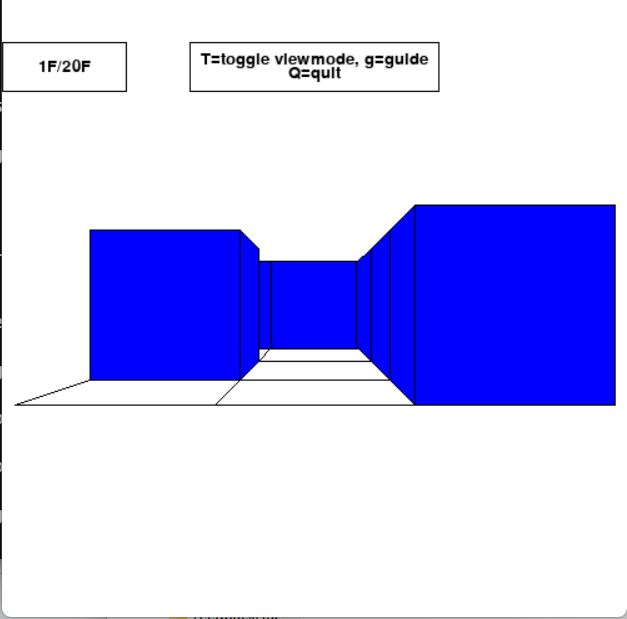
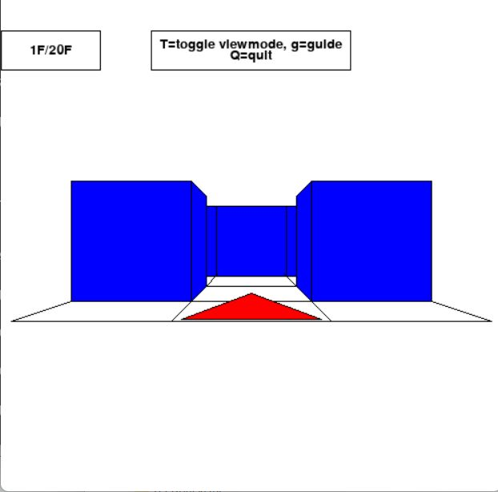

# Maze the skyscraper (高層迷宮)
This application is a maze game which features a high intricate building. It has 3D View mode and 2D Map mode. It also has a guide system for beginners.

このアプリは入り組んだ高層迷路を進んでいくゲームです。3Dモードと2D地図モードがあります。初心者向けのガイドシステムも付属しています。

## Controls (操作)
- Up/Down keys: Move forward/back
- Left/Right keys: Turn left/right
- 't' key: Toggle view (3D View <-> 2D Map)
- 'g' key: Activate/deactivate the guide system
- 'q' key: Exit

## Gallery

3D view

2D view

Guide
