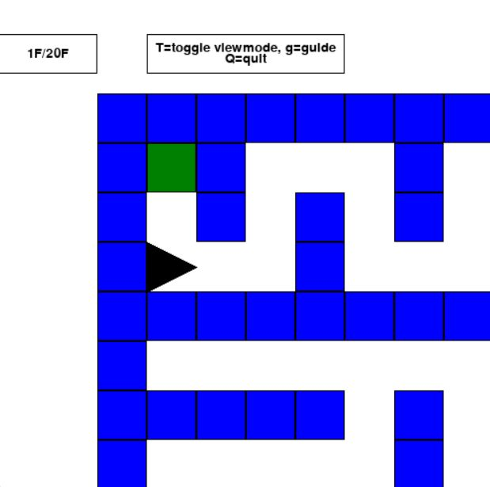

# Maze the skyscraper (高層迷宮)
This application is a maze game which features a high intricate building. It has 3D View mode and 2D Map mode. It also has a guide system for beginners. 
Every stage is randomly generated.

このアプリは入り組んだ高層迷路を進んでいくゲームです。3Dモードと2D地図モードがあります。初心者向けのガイドシステムも付属しています。迷路は自動生成されます。

## Set up (前準備)
1. Install [pygame package](https://pypi.org/project/pygame/). pygame パッケージをインストールする。
2. Download sources in this repository. 本レポジトリのソースコードをダウンロードする。
3. Run [main.py](https://github.com/yt-koike/PyMaze/blob/main/main.py) you downloaded with [Python interpreter](https://www.python.org/). Python インタプリタでダウンロードした main.py を実行する。

## How to play (遊び方)

https://user-images.githubusercontent.com/42059282/203695430-000ed900-652f-4acf-96b1-5bebac014cd8.mp4

## Controls (操作)
- Up/Down keys: Move forward/back
- Left/Right keys: Turn left/right
- 't' key: Toggle view (3D View <-> 2D Map)
- 'g' key: Activate/deactivate the guide system
- 'q' key: Exit

## Gallery

3D view

2D view

Guide
